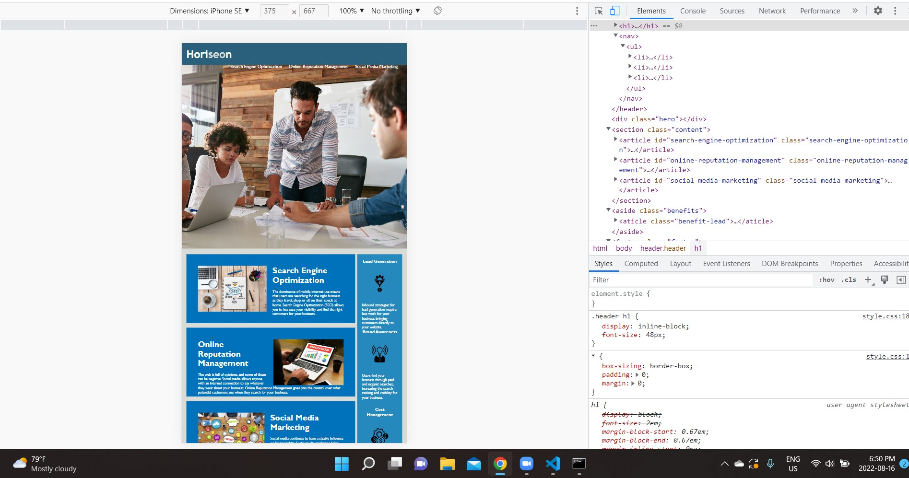

# Carleton Bootcamp Challenge 1

## Description
I used semantic HTML identifiers in my code. I changed division tags starting with a header tag. Following this, I identified the
navigation bar with a navigation tag. When going into the lower half of the site I replaced the division tag with a section tag and inside the sections, I placed article tags. On the information on the side of the page, I added an aside tag and inside this I placed additional article tags. 
I organized the code so that it would be easy for a developer to view. 
When reviewing the images I added an alternative text that reflected the name of the image. 

## Screenshot

## Live website
[Link to live website](https://kmcwilson.github.io/carleton-bootcamp-challenge-1/)
